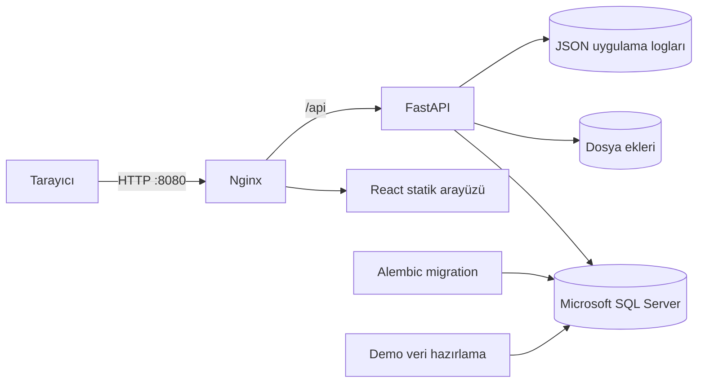

# Destek Takip

> Güncel sürüm: `0.7.0` — yalnızca yerel kullanım

Teknik destek taleplerinin oluşturulması, doğru IT çalışanına atanması, çözüm sürecinin
izlenmesi ve operasyonun raporlanması için geliştirilmiş rol tabanlı bir web uygulaması.
React arayüzü, FastAPI REST API'si ve Microsoft SQL Server veri katmanı tek bir sistem olarak
çalışır.

> Proje, gerçek bir bilgi işlem destek sürecini uçtan uca gösteren portföy ve demo uygulamasıdır.
> Şirkete özel Active Directory, kurumsal SMTP ve marka entegrasyonları bilinçli olarak kapsam
> dışında tutulmuştur.

## Öne çıkan yetenekler

| Rol | Yapabildikleri |
|---|---|
| **Çalışan (USER)** | Talep oluşturma, arama ve filtreleme; kendi talebini güncelleme veya silme; güvenli dosya eki yönetimi; çözüm ve bildirim takibi |
| **IT çalışanı (IT)** | Ortak talep havuzunu görüntüleme; talebi üzerine alma; öncelik, etiket ve takipçi yönetimi; çözüldü veya çözülemedi sonucu girme; rapor ve sistem sağlığı takibi |
| **Yönetici (ADMIN)** | Kullanıcı ve IT hesabı yönetimi; geçici parola, aktiflik ve kalıcı silme işlemleri; talepleri IT çalışanlarına atama; silinen talepleri geri yükleme; denetim kayıtları ve hazır yanıt yönetimi |

Sistemde ayrıca şunlar bulunur:

- İmzalı `HttpOnly` oturum cookie'si, CSRF ve origin doğrulaması
- İzin verilen e-posta alan adları ve role göre API yetkilendirmesi
- Talep işlem geçmişi, uygulama içi bildirimler ve kritik işlemler için denetim kaydı
- Dosya uzantısı, MIME türü ve gerçek dosya imzasını birlikte doğrulayan ek yönetimi
- Dönemsel operasyon özeti, çözüm performansı ve güvenli Excel dışa aktarma
- MSSQL, dosya alanı, çalışma süresi ve dönen JSON logları için sistem izleme ekranı
- Paylaşılan demo hesaplarının kritik profil ve yönetim işlemlerine karşı korunması

## Mimari



Docker Compose yerel ortamında MSSQL, migration, demo verisi, backend ve frontend servislerini
tek komutla kurar. Migration ile demo veri hazırlama işlemleri, uygulama başlamadan önce birer
defa çalışan ayrı servislerdir.

## Teknoloji yığını

| Katman | Teknolojiler |
|---|---|
| Frontend | React 19, React Router 7, Vite 8, Vitest, ESLint |
| Backend | Python 3.11+, FastAPI, SQLAlchemy 2, Alembic, PyODBC, Pytest, Ruff |
| Veri | Microsoft SQL Server 2022 |
| Çalıştırma | Docker, Docker Compose, Nginx |
| Gözlemlenebilirlik | Sağlık endpoint'leri, yapılandırılmış JSON loglama, web sistem izleme ekranı |

## Hızlı başlangıç

### Gereksinimler

- Docker Desktop
- Docker Compose
- İlk çalıştırmada imajları indirebilmek için internet bağlantısı

### Sistemi çalıştırma

Proje kökünde:

```powershell
docker compose --env-file .env.compose.example up --build -d
```

Servisler hazır olduğunda uygulamayı <http://localhost:8080> adresinden açın.

| Demo rolü | E-posta |
|---|---|
| Çalışan | `demo.user@example.com` |
| IT çalışanı | `demo.it@example.com` |
| Yönetici | `demo.admin@example.com` |

Üç hesabın ortak yerel parolası `.env.compose.example` içindeki
`DEMO_ACCOUNT_PASSWORD` değeridir. Bu hesaplar ve parola yalnızca yerel demo içindir.

Demo verilerini korunan hesaplar ve örnek taleplerle başlangıç durumuna döndürmek için
[container rehberindeki kontrollü sıfırlama](deployment/CONTAINERS.md#kontrollü-demo-sıfırlama)
komutunu kullanın.

Container durumlarını görmek için:

```powershell
docker compose --env-file .env.compose.example ps
```

Sistemi durdurmak için:

```powershell
docker compose --env-file .env.compose.example down
```

Veritabanı dâhil yerel demo verisini de sıfırlamak isterseniz `down` komutuna `-v` ekleyin.
Bu işlem Docker volume içindeki yerel verileri kalıcı olarak siler.

SSMS bağlantısı, servis logları ve sorun giderme adımları için
[container rehberine](deployment/CONTAINERS.md) bakın.

## Sağlık kontrolleri

| Endpoint | Amaç |
|---|---|
| `GET /api/health/live` | Backend sürecinin çalıştığını doğrular |
| `GET /api/health/ready` | MSSQL bağlantısının hazır olduğunu doğrular |
| `GET /api/it/system/overview` | IT ve ADMIN için uygulama, MSSQL, upload ve log özetini verir |
| `GET /api/it/system/logs` | IT ve ADMIN için güvenli uygulama olaylarını listeler |

## Geliştirme ve doğrulama

Container kullanmadan geliştirmek için sırasıyla [backend kurulumunu](backend/README.md) ve
[frontend kurulumunu](frontend/README.md) tamamlayın.

Backend kalite kontrolleri:

```powershell
cd backend
python -m pytest
python -m ruff check app tests
```

Frontend kalite kontrolleri:

```powershell
cd frontend
npm test
npm run lint
npm run build
```

## Proje yapısı

```text
.
├── backend/                FastAPI uygulaması, migration'lar ve backend testleri
├── frontend/               React arayüzü ve frontend testleri
├── deployment/             Yerel container kurulum dosyaları
├── compose.yaml            Yerel uçtan uca çalışma ortamı
├── .env.compose.example    Secret içermeyen yerel örnek ayarlar
└── README.md
```

İlk analiz belgeleri, çalışma verileri ve makineye özel ortam dosyaları Git tarafından
izlenmez. Gerçek `.env`, veritabanı, upload, log ve kullanıcı dosyaları proje kaynaklarından
ayrı tutulur.

## Yapılandırma

Başlıca ayarlar environment değişkenleriyle yönetilir:

| Değişken | Amaç |
|---|---|
| `APP_ALLOWED_EMAIL_DOMAINS` | Kayıt ve profil işlemlerinde izin verilen e-posta alan adları |
| `APP_PUBLIC_REGISTRATION_ENABLED` | Yerel kullanıcı kaydını açar veya kapatır |
| `APP_DEMO_MODE` | Paylaşılan demo hesaplarının korunmasını etkinleştirir |
| `APP_DEMO_PROTECTED_EMAILS` | Korunacak demo hesaplarını belirler |
| `APP_EMAIL_DELIVERY_ENABLED` | Uygulama içi bildirimlerden bağımsız SMTP teslimini yönetir |
| `APP_SESSION_SECRET` | Oturum imzalama anahtarıdır; yerel dosyada tutulmalı ve paylaşılmamalıdır |
| `VITE_APP_NAME` | Arayüzde gösterilen ürün adını belirler |
| `VITE_PUBLIC_REGISTRATION_ENABLED` | Kayıt bağlantısı ve ekranının build ayarıdır |

Tüm backend ayarları için [backend dokümantasyonunu](backend/README.md) inceleyin.

## Yerel çalışma durumu

- [x] Rol bazlı web uygulaması ve REST API
- [x] MSSQL şeması ve Alembic migration'ları
- [x] Otomatik testler ve yerel Docker Compose ortamı
- [x] Güvenli demo hesapları ve örnek yapılandırma
- [x] USER, IT ve ADMIN için yerel demo verileri
- [x] Yerel test, lint ve build komutları

Proje yalnızca yerel kullanım için yapılandırılmıştır.

## Güvenlik notu

Bu repository gerçek kullanıcı parolası içermez. Örnek `.env` değerleri yalnızca yerel
geliştirme içindir ve başka sistemlerde tekrar kullanılmamalıdır. Yerel `.env`, veritabanı,
upload ve log içerikleri kaynak koddan ayrı tutulmalıdır.
